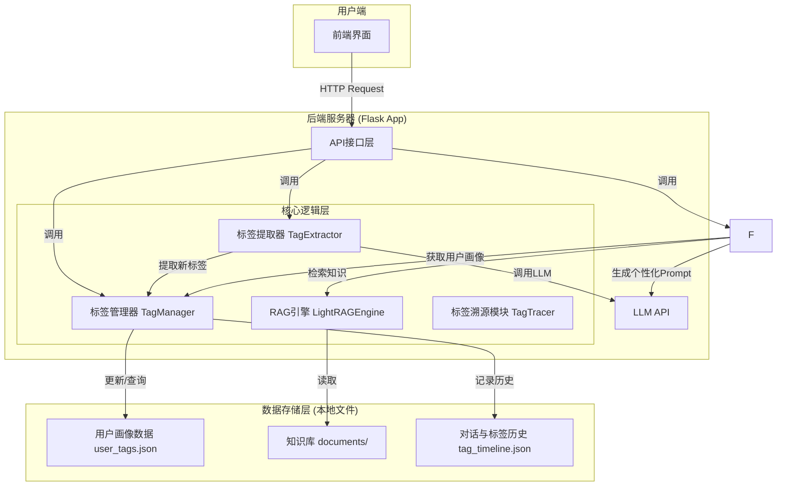
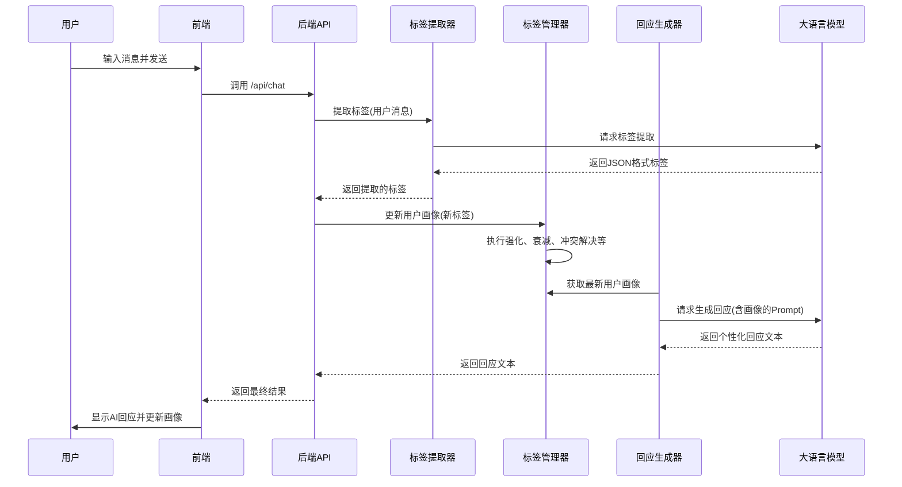

# AQ-用户标签系统 - 核心技术方案文档

## 1. 系统概述

### 1.1 项目目标

本项目旨在构建一个智能用户医疗方向画像系统。系统通过分析用户与医疗AI助手的对话内容，利用大型语言模型（LLM）自动提取并管理一套动态更新的用户标签，从而形成多维度的用户画像。最终分析人员可以根据此画像来做出更多有效的分析。

### 1.2 核心功能

*   **实时对话分析**: 实时处理用户输入，进行语义理解。
*   **动态标签提取**: 基于LLM从对话中提取多个维度的标签。
*   **动态用户画像**: 标签具有权重和时效性，会随着时间推移和新的对话输入而动态演进。
*   **标签溯源**: 提供标签来源的追溯功能，清晰展示每个标签是由哪段对话触发的。

### 1.3 技术栈

*   **后端**: Python + Flask
*   **核心引擎**: 基于LLM（DeepSeek）的自定义RAG流程
*   **数据存储**: 本地文件系统 (JSON)，可扩展至SQLite等数据库
*   **前端**: HTML, CSS, JavaScript (用于Demo演示)

## 2. 系统架构

系统采用模块化的分层架构，主要包括前端、后端应用层、核心逻辑层和数据存储层。



*   **前端界面 (`index.html`)**: 用户交互的入口，负责展示对话和动态更新的用户画像。
*   **API接口层 (`web/app.py`)**: 基于Flask，提供如`/api/chat`等核心接口，处理前端请求，并调度核心逻辑层完成任务。
*   **核心逻辑层 (`app/core/`)**:
    *   `TagExtractor`: 负责调用LLM，从用户输入中提取结构化的标签信息。
    *   `TagManager`: 系统的核心，负责管理用户所有标签的生命周期，包括新增、强化、衰减、冲突解决和相似性合并。
    *   `LightRAGEngine`: 实现简化的RAG流程，管理与用户相关的知识库，并提供检索能力。
    *   `TagTracer`: 记录标签的每次变化，为标签溯源功能提供数据支持。
*   **数据存储层 (`user_data/`)**: 以用户ID进行物理隔离，每个用户拥有独立的画像和知识库文件。
*   **LLM API**: 外部大模型服务，是整个系统语义理解和内容生成能力的基础。

## 3. 核心模块详解

### 3.1 标签提取 (`TagExtractor`)

标签提取是构建用户画像的第一步。

*   **工作流程**:
    1.  接收到用户文本后，构建一个精心设计的Prompt。
    2.  该Prompt指示LLM扮演一个“用户画像构建师”的角色，从多个预设维度（如“年龄段”、“性别”，“具体意图分类”）分析文本。如果文本有对应的比如用户的文本蕴含着用户意图是寻求就医指导，就在一级标签用户意图与转化阶段的二级标签具体意图分类匹配上寻求就医指导，也就是打上”寻求就医指导“这个标签。
    3.  LLM被要求以固定的JSON格式返回结果，每个标签都包含`tag`（标签名）、`confidence`（置信度）和`evidence`（证据原文）。
*   **关键设计**:
    *   **结构化输出**: 强制LLM输出JSON，便于后端直接解析，避免了复杂的文本处理。
    *   **多维度提取**: 通过Prompt指令，一次调用即可从多个维度提取标签，效率高。
    *   **附带证据**: 要求LLM提供`evidence`，为后续的标签溯源提供了直接依据。

### 3.2 标签管理 (`TagManager`)

`TagManager`是整个用户画像系统的“大脑”，它维护着一个复杂但有序的标签体系。

*   **标签数据结构**:
    采用层级结构：**一级标签(level_1_tag) -> 二级标签(level_2_tag) -> 标签 (Tag)**。
    ```json
{
  "user_tags_system": [
    {
      "level_1_tag": "用户核心画像",
      "description": "此标签主要用于识别用户的基本属性和其在健康管理中所扮演的角色。",
      "level_2_tags": [
        {
          "level_2_tag": "年龄段",
          "values": [
            {
              "name": "婴幼儿 (0-3岁)",
              "description": "核心关注点为喂养、发育、常见病（发烧、腹泻）、疫苗接种，用户通常为其父母。"
            },
            {
              "name": "儿童 (4-11岁)",
              "description": "核心关注点为生长发育、意外伤害、常见传染病、视力、牙齿健康，用户多为其父母。"
            },
            {
              "name": "青少年 (12-17岁)",
              "description": "核心关注点为青春期发育、心理健康、学业压力、运动损伤、皮肤问题（痤疮），用户可能为本人或父母。"
            },
            {
              "name": "青年 (18-40岁)",
              "description": "核心关注点为工作压力、生活作息、生殖健康、常见病（感冒、肠胃炎）、运动健身、皮肤管理，用户主要为本人。"
            },
            {
              "name": "中年 (41-65岁)",
              "description": "核心关注点为慢性病风险（高血压、糖尿病）、体检指标解读、癌症筛查、更年期保健，用户多为本人或子女。"
            },
            {
              "name": "老年 (65岁以上)",
              "description": "核心关注点为慢性病管理、多重用药、骨骼健康（骨质疏松）、认知功能（阿尔茨海默病），用户可能为本人或子女。"
            }
          ]
        },
        {
          "level_2_tag": "性别",
          "values": [
            {
              "name": "男",
              "description": "关注点可能偏向于运动损伤、心血管健康、前列腺问题、脱发等。"
            },
            {
              "name": "女",
              "description": "关注点可能偏向于妇科健康、孕产育儿、皮肤管理、更年期保健等。"
            }
          ]
        },
        {
          "level_2_tag": "所在地区",
          "values": [
            {
              "name": "一线城市",
              "description": "医疗资源丰富，用户可能更关注前沿医疗信息、高端私立医疗服务，对新技术接受度高。"
            },
            {
              "name": "二线城市",
              "description": "医疗资源较好，用户关注点均衡，兼顾公立医院信息和线上便捷医疗服务。"
            },
            {
              "name": "三线及以下城市",
              "description": "医疗资源相对有限，更依赖线上问诊解决常见病，对药品信息、异地就医指南有更高需求。"
            }
          ]
        },
        {
          "level_2_tag": "健康角色",
          "values": [
            {
              "name": "个人健康管理者",
              "description": "主要为自己咨询，频繁使用AI诊室、健康档案、减重专区等功能。"
            },
            {
              "name": "家庭健康决策者",
              "description": "咨询内容涉及家人（如儿童、老人），可能为父母、子女进行问诊或查询药品信息。"
            },
            {
              "name": "慢性病患者",
              "description": "长期、周期性地查询特定疾病（如糖尿病、高血压），并可能使用健康数据自动同步功能（如血糖仪、血压计）。"
            },
            {
              "name": "临时求助者",
              "description": "使用频率低，多为紧急的、一次性的症状或药品查询。"
            },
            {
              "name": "健康生活追求者",
              "description": "偏好使用健康养生、饮食热量识别、减重专区等功能。"
            }
          ]
        }
      ]
    },
    {
      "level_1_tag": "产品使用路径与偏好",
      "description": "此标签用于分析用户与产品功能的交互习惯，揭示其偏好的功能和交互方式。",
      "level_2_tags": [
        {
          "level_2_tag": "核心功能偏好",
          "values": [
            {
              "name": "AI诊断依赖型",
              "description": "核心路径为 `AI诊室`、`拍报告`、`拍皮肤`，强依赖AI进行初步诊断。"
            },
            {
              "name": "信息查询导向型",
              "description": "核心路径为 `疾病知识查询`、`用药指导`、`名医AI分身`，将产品作为健康百科使用。"
            },
            {
              "name": "服务闭环驱动型",
              "description": "核心路径涉及 `在线问诊` -> `预约挂号` -> `线上买药`，有明确的线下/线上医疗服务需求。"
            },
            {
              "name": "健康管理践行型",
              "description": "核心路径为 `健康档案管理`、`健康数据自动同步`（穿戴设备）、`减重专区`。"
            },
            {
              "name": "医保服务利用型",
              "description": "核心路径为 `医保问答`、`医保码` 相关功能。"
            }
          ]
        },
        {
          "level_2_tag": "交互方式偏好",
          "values": [
            {
              "name": "语音交互型",
              "description": "偏好通过语音进行多轮对话问诊。"
            },
            {
              "name": "文本交互型",
              "description": "偏好使用手动输入文字进行查询。"
            },
            {
              "name": "图像识别型",
              "description": "频繁使用 `拍报告`、`拍药盒`、`拍皮肤`、`饮食热量识别` 等功能。"
            },
            {
              "name": "小程序服务型",
              "description": "经常通过点击按钮跳转至小程序完成挂号、买药、问诊等操作。"
            },
            {
              "name": "智能设备联动型",
              "description": "已绑定并同步VIVO、华为、鱼跃等智能穿戴或检测设备的数据。"
            }
          ]
        }
      ]
    },
    {
      "level_1_tag": "用户意图与转化阶段",
      "description": "此标签旨在洞察用户使用产品背后的深层需求，并判断其在医疗健康服务消费链路中所处的阶段。",
      "level_2_tags": [
        {
          "level_2_tag": "具体意图分类",
          "values": [
            {
              "name": "症状自我评估",
              "description": "“我[症状]，可能是什么病？”"
            },
            {
              "name": "专业报告解读",
              "description": "“帮我看看这张化验单。”"
            },
            {
              "name": "药品信息核对",
              "description": "“这个药怎么吃？有什么副作用？”"
            },
            {
              "name": "寻求就医指导",
              "description": "“我应该挂哪个科？哪个医生好？”"
            },
            {
              "name": "生活方式改善",
              "description": "“我体质虚寒该怎么注意饮食？”"
            },
            {
              "name": "付费服务咨询",
              "description": "正在使用或咨询 `在线问诊` 等付费服务。"
            },
            {
              "name": "医保政策/流程查询",
              "description": "关心医保报销、异地就医等问题。"
            }
          ]
        },
        {
          "level_2_tag": "转化阶段",
          "values": [
            {
              "name": "信息认知阶段",
              "description": "广泛浏览健康科普、疾病知识。"
            },
            {
              "name": "问题分析阶段",
              "description": "使用AI诊室、拍报告等功能分析具体健康问题。"
            },
            {
              "name": "决策行动阶段",
              "description": "查询医生/医院信息、使用预约挂号功能。"
            },
            {
              "name": "服务消费阶段",
              "description": "使用在线问诊（付费）、线上买药、医保码支付等功能。"
            }
          ]
        }
      ]
    },
    {
      "level_1_tag": "用户商业价值",
      "description": "此标签从运营和商业化角度出发，对用户的价值进行分层，以便进行精细化运营。",
      "level_2_tags": [
        {
          "level_2_tag": "价值等级",
          "values": [
            {
              "name": "高价值用户",
              "description": "有过 `在线问诊`、`线上买药` 等付费行为，或频繁使用服务闭环相关功能。"
            },
            {
              "name": "高潜力用户",
              "description": "频繁使用AI诊断相关功能，有转化为付费用户的可能。"
            },
            {
              "name": "高活跃用户",
              "description": "每日/周登录，但主要使用信息查询、健康管理等免费功能。"
            },
            {
              "name": "低频用户",
              "description": "仅在有明确、紧急需求时偶尔使用。"
            },
            {
              "name": "流失风险用户",
              "description": "曾为活跃用户，但近期活跃度显著下降。"
            }
          ]
        },
        {
          "level_2_tag": "付费敏感度",
          "values": [
            {
              "name": "价格不敏感",
              "description": "直接使用付费服务。"
            },
            {
              "name": "价格敏感",
              "description": "多次进入付费页面但未完成支付。"
            },
            {
              "name": "纯免费用户",
              "description": "从未使用过任何付费相关功能。"
            }
          ]
        }
      ]
    }
  ]
}
    ```


## 4. 数据流

一次完整的用户交互数据流如下：



## 5. 如何复现系统

### 5.1 环境准备

1.  **克隆/下载项目**: 获取所有源代码。
2.  **创建虚拟环境**:
    ```bash
    python -m venv venv
    source venv/bin/activate  # on Linux/Mac
    ```
3.  **安装依赖**:
    ```bash
    pip install -r requirements.txt
    ```

### 5.2 配置

1.  找到`config.yaml`文件。
2.  在`llm`部分填入你的LLM API Key和正确的`base_url`。
    ```yaml
    llm:
      provider: "deepseek"
      model: "deepseek-chat"
      api_key: "sk-82ef8a72fca243c68624ed2c909ae906"
      base_url: "https://api.deepseek.com"
    ```

### 5.3 运行

1.  确保必要的目录已创建（`run_demo.py`会自动创建）。
2.  在项目根目录下运行启动脚本：
    ```bash
    python run_demo.py
    ```
3.  系统启动后，在浏览器中访问 `http://127.0.0.1:8080` 即可开始体验。

## 6. 核心代码实现

### 6.1 依赖配置 (`requirements.txt`)
```txt
lightrag==0.1.0
openai==1.3.0
chromadb==0.4.15
fastapi==0.104.1
uvicorn==0.24.0
pydantic==2.5.0
python-multipart==0.0.6
jinja2==3.1.2
aiofiles==23.2.1
sqlite3
pandas==2.1.3
numpy==1.24.3
networkx==3.2
flask==3.0.0
PyYAML
```

### 6.2 项目配置 (`config.yaml`)
```yaml
# LightRAG标签系统配置
app:
  name: "AQ-RAG-TagSystem"
  version: "1.0.0"
  debug: true

llm:
    provider: "deepseek"
    model: "deepseek-chat"
    api_key: "sk-82ef8a72fca243c68624ed2c909ae906"
    base_url: "https://api.deepseek.com" # 默认为OpenAI, 可修改为DeepSeek等
  max_tokens: 500
  temperature: 0.7

embedding:
  provider: "openai"
  model: "text-embedding-ada-002"
  
storage:
  type: "local"
  base_path: "./user_data"
  backup_enabled: true
  cleanup_days: 90


```


    
  
### 6.4 后端API与路由 (`web/app.py`)
```python
from flask import Flask, render_template, request, jsonify, session
import uuid
import json
from datetime import datetime
from app.core.lightrag_engine import LightRAGEngine
from app.core.tag_extractor import TagExtractor  
from app.core.tag_manager import TagManager

app = Flask(__name__)
app.secret_key = 'lightrag_demo_secret_key'

@app.route('/')
def index():
    """主页"""
    return render_template('index.html')

@app.route('/api/chat', methods=['POST'])
def chat():
    """聊天接口"""
    try:
        data = request.json
        user_message = data.get('message', '')
        
        # 获取或创建用户ID
        if 'user_id' not in session:
            session['user_id'] = str(uuid.uuid4())
        
        user_id = session['user_id']
        
        # 初始化组件
        tag_extractor = TagExtractor(user_id)
        tag_manager = TagManager(user_id)
        response_generator = ResponseGenerator(user_id)
        
        # 提取标签
        extracted_tags = tag_extractor.extract_tags_from_text(user_message)
        
        # 更新标签
        updated_tags = tag_manager.update_tags(extracted_tags)
        
        
        # 记录对话
        conversation_log = {
            "timestamp": datetime.now().isoformat(),
            "user_message": user_message,
            "assistant_response": response_data["response"],
            "extracted_tags": {k: [{"name": tag.name, "confidence": tag.confidence} for tag in v] for k, v in extracted_tags.items()},
            "search_strategy": response_data["search_strategy"]
        }
        
        return jsonify({
            "success": True,
            "response": response_data["response"],
            "user_profile": response_data["user_profile_snapshot"],
            "extracted_tags": {k: [{"name": tag.name, "confidence": tag.confidence} for tag in v] for k, v in extracted_tags.items()},
            "conversation_log": conversation_log
        })
        
    except Exception as e:
        return jsonify({
            "success": False,
            "error": str(e)
        }), 500

@app.route('/api/profile')
def get_profile():
    """获取用户画像"""
    try:
        if 'user_id' not in session:
            return jsonify({"success": False, "error": "用户未初始化"})
        
        user_id = session['user_id']
        tag_manager = TagManager(user_id)
        user_tags = tag_manager.get_user_tags()
        
        return jsonify({
            "success": True,
            "user_tags": user_tags
        })
        
    except Exception as e:
        return jsonify({
            "success": False,
            "error": str(e)
        }), 500

@app.route('/api/add_knowledge', methods=['POST'])
def add_knowledge():
    """添加知识"""
    try:
        if 'user_id' not in session:
            return jsonify({"success": False, "error": "用户未初始化"})
        
        data = request.json
        knowledge_text = data.get('text', '')
        metadata = data.get('metadata', {})
        
        user_id = session['user_id']
        lightrag = LightRAGEngine(user_id)
        
        result = lightrag.insert_knowledge(knowledge_text, metadata)
        
        return jsonify(result)
        
    except Exception as e:
        return jsonify({
            "success": False,
            "error": str(e)
        }), 500

@app.route('/api/reset_user', methods=['POST'])
def reset_user():
    """重置用户（新建用户会话）"""
    session.pop('user_id', None)
    return jsonify({"success": True, "message": "用户会话已重置"})

if __name__ == '__main__':
    app.run(debug=True, port=5000)
```

### 6.5 RAG引擎 (`app/core/lightrag_engine.py`)
```python
import os
import json
import yaml
import openai
from typing import Dict, List, Optional

class LightRAGEngine:
    def __init__(self, user_id: str):
        self.user_id = user_id
        self.user_data_path = f"user_data/{user_id}"
        self.ensure_user_directory()
        
        self.config = self._load_config()
        self.openai_client = self._create_openai_client()
        
    def _load_config(self):
        try:
            with open('config.yaml', 'r', encoding='utf-8') as f:
                return yaml.safe_load(f)
        except Exception as e:
            print(f"警告: 无法加载配置文件: {e}")
            return {}
    
    def _create_openai_client(self):
        api_key = self.config.get('llm', {}).get('api_key')
        base_url = self.config.get('llm', {}).get('base_url')
        
        if not api_key:
            raise ValueError("API key is required")
        
        return openai.OpenAI(api_key=api_key, base_url=base_url)
        
    def ensure_user_directory(self):
        os.makedirs(self.user_data_path, exist_ok=True)
        os.makedirs(f"{self.user_data_path}/documents", exist_ok=True)
        
    def insert_knowledge(self, text: str, metadata: Dict = None):
        try:
            doc_data = {
                "content": text,
                "metadata": metadata or {},
                "user_id": self.user_id,
                "timestamp": json.dumps({"created": "now"}, default=str)
            }
            docs_dir = f"{self.user_data_path}/documents"
            os.makedirs(docs_dir, exist_ok=True)
            existing_files = [f for f in os.listdir(docs_dir) if f.endswith('.json')]
            doc_file = f"{docs_dir}/doc_{len(existing_files)}.json"
            
            with open(doc_file, 'w', encoding='utf-8') as f:
                json.dump(doc_data, f, ensure_ascii=False, indent=2)
                
            return {"status": "success", "message": "知识插入成功"}
        except Exception as e:
            return {"status": "error", "message": f"插入失败: {str(e)}"}
    
    def query_knowledge(self, query: str, mode: str = "hybrid") -> str:
        try:
            documents_dir = f"{self.user_data_path}/documents"
            if not os.path.exists(documents_dir):
                return "知识库为空，请先添加一些知识。"
            
            relevant_docs = []
            doc_files = [f for f in os.listdir(documents_dir) if f.endswith('.json')]
            
            for doc_file in doc_files[:5]:
                doc_path = os.path.join(documents_dir, doc_file)
                try:
                    with open(doc_path, 'r', encoding='utf-8') as f:
                        doc_data = json.load(f)
                        content = doc_data.get('content', '')
                        
                        query_words = query.lower().split()
                        content_lower = content.lower()
                        
                        if any(word in content_lower for word in query_words):
                            relevant_docs.append(content[:200] + "..." if len(content) > 200 else content)
                except Exception as e:
                    continue
            
            if relevant_docs:
                return f"找到相关知识:\n" + "\n\n".join(relevant_docs)
            else:
                return "未找到相关知识，但我会基于一般知识来回答您的问题。"
                
        except Exception as e:
            return f"查询错误: {str(e)}"
```

### 6.6 标签提取器 (`app/core/tag_extractor.py`)
```python
import json
import re
import yaml
import openai
from datetime import datetime
from typing import Dict, List
from dataclasses import dataclass

@dataclass
class TagInfo:
    name: str
    confidence: float
    evidence: str
    category: str
    subcategory: str

class TagExtractor:
    def __init__(self, user_id: str):
        self.user_id = user_id
        self.config = self._load_config()
        self.llm_client = self._create_llm_client()
        self.tag_categories = self.config.get('tag_system', {}).get('categories', {})
        
    def _load_config(self):
        with open("config.yaml", 'r', encoding='utf-8') as f:
            return yaml.safe_load(f)
            
    def _create_llm_client(self):
        return openai.OpenAI(
            api_key=self.config.get('llm', {}).get('api_key'),
            base_url=self.config.get('llm', {}).get('base_url')
        )
        
    def extract_tags_from_text(self, text: str, context: Dict = None) -> Dict[str, List[TagInfo]]:
        extraction_prompt = self._build_extraction_prompt(text, context)
        
        try:
            llm_response = self.llm_client.chat.completions.create(
                model=self.config.get('llm',{}).get('model'),
                messages=[{"role": "user", "content": extraction_prompt}],
                max_tokens=self.config.get('llm',{}).get('max_tokens', 1000),
                temperature=self.config.get('llm',{}).get('temperature', 0.3),
                response_format={"type": "json_object"}
            ).choices[0].message.content
            
            extracted_tags = self._parse_llm_response(llm_response, text)
            return extracted_tags
            
        except Exception as e:
            print(f"标签提取错误: {e}")
            return {}
    
    def _build_extraction_prompt(self, text: str, context: Dict = None) -> str:
        # This prompt needs to be carefully designed based on the tag structure in config.yaml
        # Here is a generic example
        prompt = f"""
        Analyze the user text and extract tags based on the provided categories.
        User text: "{text}"
        
        Categories and subcategories:
        {json.dumps(self.tag_categories, indent=2, ensure_ascii=False)}
        
        Output in JSON format with keys for each main category. For each tag, provide name, confidence (0.1-1.0), evidence from the text, and the subcategory key.
        Example format:
        {{
          "demographic_info": [
            {{
              "tag_name": "20-30岁",
              "confidence": 0.8,
              "evidence": "我今年25岁",
              "subcategory": "age"
            }}
          ],
          "interests_hobbies": []
        }}
        """
        return prompt
    
    def _parse_llm_response(self, response: str, original_text: str) -> Dict[str, List[TagInfo]]:
        try:
            tag_data = json.loads(response)
            parsed_tags = {}
            for category_key, tags in tag_data.items():
                if category_key not in parsed_tags:
                    parsed_tags[category_key] = []
                for tag_info in tags:
                    tag = TagInfo(
                        name=tag_info.get("tag_name", ""),
                        confidence=tag_info.get("confidence", 0.5),
                        evidence=tag_info.get("evidence", ""),
                        category=category_key,
                        subcategory=tag_info.get("subcategory", "other")
                    )
                    parsed_tags[category_key].append(tag)
            return parsed_tags
        except Exception as e:
            print(f"解析LLM响应错误: {e}")
            return {}
```

### 6.7 标签管理器 (`app/core/tag_manager.py`)
```python
import json
import os
from datetime import datetime, timedelta
from typing import Dict, List
from app.core.tag_extractor import TagInfo

class TagManager:
    def __init__(self, user_id: str):
        self.user_id = user_id
        self.user_data_path = f"user_data/{user_id}"
        self.tags_file = f"{self.user_data_path}/user_tags.json"
        self.timeline_file = f"{self.user_data_path}/tag_timeline.json"
        self._ensure_tag_files()
        
    def _ensure_tag_files(self):
        os.makedirs(self.user_data_path, exist_ok=True)
        if not os.path.exists(self.tags_file):
            self._create_empty_tags_file()
        if not os.path.exists(self.timeline_file):
            with open(self.timeline_file, 'w', encoding='utf-8') as f:
                json.dump({"user_id": self.user_id, "tag_events": []}, f)

    def _create_empty_tags_file(self):
        # This structure should match your desired user profile structure
        # A more complex example with subcategories is in the project files
        empty_tags = {
            "user_id": self.user_id,
            "created_at": datetime.now().isoformat(),
            "last_updated": datetime.now().isoformat(),
            "tag_dimensions": {
                # ... dimensions based on config ...
            },
            "computed_metrics": {}
        }
        with open(self.tags_file, 'w', encoding='utf-8') as f:
            json.dump(empty_tags, f, ensure_ascii=False, indent=2)

    def update_tags(self, extracted_tags: Dict[str, List[TagInfo]]) -> Dict:
        current_tags = self._load_current_tags()
        
        for dimension, new_tags in extracted_tags.items():
            if dimension in current_tags["tag_dimensions"]:
                # Logic to update tags, handle subcategories, etc.
                self._update_dimension_tags(
                    current_tags["tag_dimensions"][dimension], 
                    new_tags
                )
        
        self._recalculate_weights_and_metrics(current_tags)
        current_tags["last_updated"] = datetime.now().isoformat()
        self._save_tags(current_tags)
        self._record_tag_timeline(extracted_tags)
        return current_tags

    def _load_current_tags(self) -> Dict:
        with open(self.tags_file, 'r', encoding='utf-8') as f:
            return json.load(f)

    def _save_tags(self, tags_data: Dict):
        with open(self.tags_file, 'w', encoding='utf-8') as f:
            json.dump(tags_data, f, ensure_ascii=False, indent=2)

    def _update_dimension_tags(self, dimension_data: Dict, new_tags: List[TagInfo]):
        # This is a complex part of the logic.
        # It needs to handle subcategories, find existing tags,
        # reinforce them, or create new ones.
        # Also, conflict resolution and similarity detection would be called here.
        pass

    def _apply_time_decay(self, active_tags: List[Dict]):
        now = datetime.now()
        for tag in active_tags:
            last_reinforced = datetime.fromisoformat(tag["last_reinforced"])
            days_since = (now - last_reinforced).days
            decay_factor = max(0.1, 1.0 - (days_since * tag.get("decay_rate", 0.1) / 30))
            tag["current_weight"] = tag["avg_confidence"] * decay_factor

    def _recalculate_weights_and_metrics(self, tags_data: Dict):
        # Logic to calculate dominant tags, dimension weights, stability,
        # and overall metrics like emotional_health_index.
        pass

    def _record_tag_timeline(self, extracted_tags: Dict[str, List[TagInfo]]):
        # Appends the new extraction event to the timeline file.
        pass

    def get_user_tags(self) -> Dict:
        return self._load_current_tags()
```


### 6.9 前端界面 (`web/templates/index.html`)
```html
<!DOCTYPE html>
<html lang="zh-CN">
<head>
    <meta charset="UTF-8">
    <meta name="viewport" content="width=device-width, initial-scale=1.0">
    <title>AQ-用户标签系统</title>
    <style>
        body { font-family: sans-serif; margin: 0; display: flex; height: 100vh; background-color: #f0f2f5; }
        .container { display: flex; width: 100%; height: 100%; }
        .chat-section { flex: 2; display: flex; flex-direction: column; margin: 10px; border-radius: 8px; background: white; box-shadow: 0 2px 4px rgba(0,0,0,0.1); }
        .profile-section { flex: 1; margin: 10px; padding: 20px; border-radius: 8px; background: white; box-shadow: 0 2px 4px rgba(0,0,0,0.1); overflow-y: auto; }
        .chat-header { padding: 20px; background: #4A90E2; color: white; border-radius: 8px 8px 0 0; }
        .chat-messages { flex: 1; padding: 20px; overflow-y: auto; }
        .message { margin-bottom: 15px; padding: 10px 15px; border-radius: 18px; max-width: 80%; word-wrap: break-word; }
        .user-message { background: #007bff; color: white; margin-left: auto; border-bottom-right-radius: 4px; }
        .assistant-message { background: #e9ecef; color: #333; border-bottom-left-radius: 4px; }
        .chat-input { display: flex; padding: 20px; border-top: 1px solid #ddd; }
        #messageInput { flex: 1; padding: 10px; border: 1px solid #ccc; border-radius: 20px; }
        .chat-input button { margin-left: 10px; padding: 10px 20px; border: none; border-radius: 20px; background-color: #007bff; color: white; cursor: pointer; }
    </style>
</head>
<body>
    <div class="container">
        <div class="chat-section">
            <div class="chat-header"><h2>🤖 AQ-智能医疗助手</h2></div>
            <div class="chat-messages" id="chatMessages">
                <div class="message assistant-message">你好！随便聊点什么吧！</div>
            </div>
            <div class="chat-input">
                <input type="text" id="messageInput" placeholder="输入你想说的话..." onkeypress="if(event.key==='Enter') sendMessage()">
                <button onclick="sendMessage()">发送</button>
            </div>
        </div>
        <div class="profile-section">
            <h2 id="profile-title">👤 用户画像</h2>
            <div id="profileContent"><p>开始对话后，这里会显示用户画像标签。</p></div>
        </div>
    </div>

    <script>
        async function sendMessage() {
            const input = document.getElementById('messageInput');
            const message = input.value.trim();
            if (!message) return;

            addMessageToChat('user', message);
            input.value = '';

            try {
                const response = await fetch('/api/chat', {
                    method: 'POST',
                    headers: { 'Content-Type': 'application/json' },
                    body: JSON.stringify({ message: message })
                });
                const data = await response.json();

                if (data.success) {
                    addMessageToChat('assistant', data.response);
                    updateProfile(data.user_profile);
                } else {
                    addMessageToChat('assistant', '错误: ' + data.error);
                }
            } catch (error) {
                addMessageToChat('assistant', '网络连接错误。');
            }
        }

        function addMessageToChat(sender, text) {
            const chatMessages = document.getElementById('chatMessages');
            const messageDiv = document.createElement('div');
            messageDiv.className = `message ${sender}-message`;
            messageDiv.textContent = text;
            chatMessages.appendChild(messageDiv);
            chatMessages.scrollTop = chatMessages.scrollHeight;
        }

        function updateProfile(profileData) {
            const profileContent = document.getElementById('profileContent');
            if (!profileData || !profileData.active_dimensions) {
                profileContent.innerHTML = '<p>暂无画像数据。</p>';
                return;
            }
            let html = `<h4>画像成熟度: ${(profileData.profile_maturity * 100).toFixed(1)}%</h4>`;
            profileData.active_dimensions.forEach(dim => {
                html += `
                    <div>
                        <strong>${dim.dimension}:</strong> 
                        <span>${dim.dominant_tag} (权重: ${dim.weight.toFixed(2)})</span>
                    </div>
                `;
            });
            profileContent.innerHTML = html;
        }
    </script>
</body>
</html>
```
